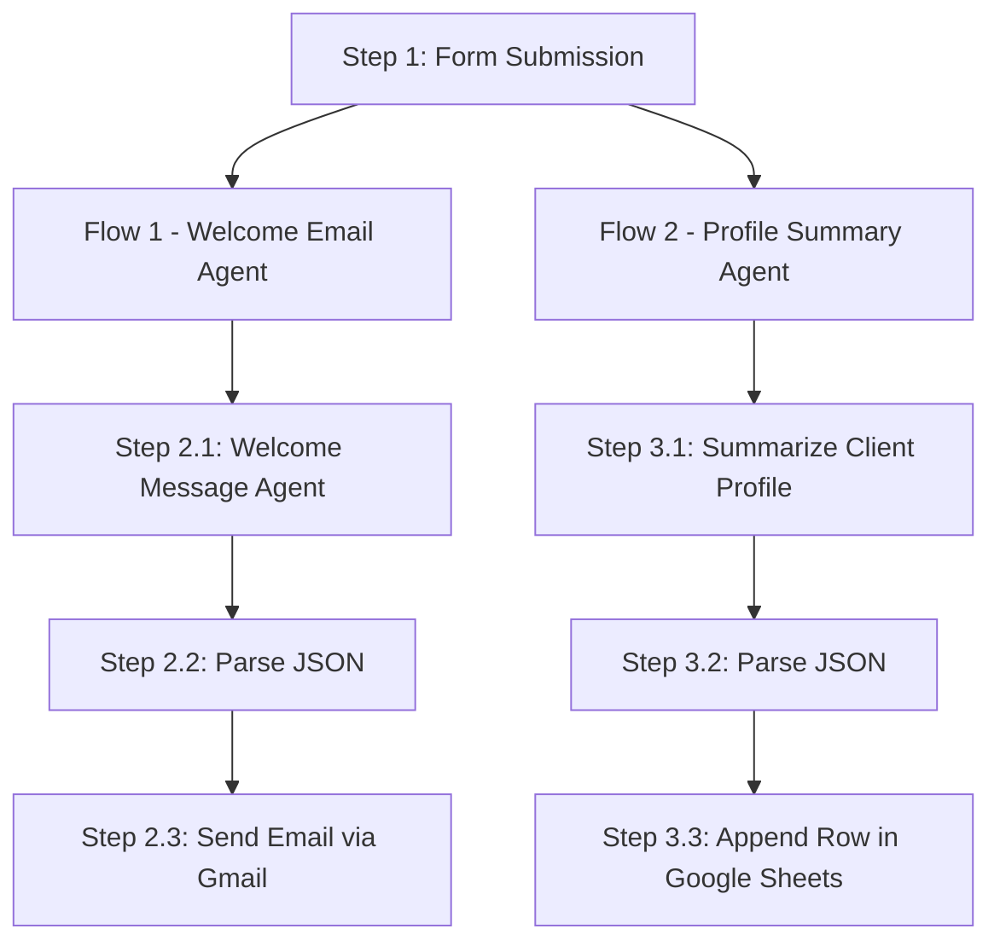

# Client Onboarding AI Agent

    

---

## Customer Problem, Project Objective & Outcomes

**Customer Pain Points (What Clients face today)**

* Slow, manual onboarding: teams draft welcome emails by hand which causes delays in first contact and inconsistent messaging.
* Fragmented data: client details end up in multiple tools or in people’s heads, making follow-ups and analytics error-prone.
* Inconsistent brand voice and missed SLAs: onboarding communications vary by rep, causing poor first impressions.
* Low operational efficiency: manual steps (compose, QA, add to CRM) consume time that could be spent delivering value.

## Project Objective (Why we built this)**
Build a lightweight, production-ready automation that turns a single client form submission into immediate, consistent onboarding actions — ensuring every new client gets a personalized welcome while structured profile data is captured for operations and CRM. The solution must be auditable, repeatable, and easy to maintain.

**What we Achieved (Concrete outcomes)**

* Immediate personalized outreach: every client receives a concise, on-brand welcome email tailored to their industry and goals.
* Structured data capture: a CRM-friendly client summary is auto-generated and appended to Google Sheets (or a CRM ingestion pipeline).
* Faster time-to-first-action: parallelization reduces manual latency so teams can begin engagement minutes after sign-up.
* Consistent brand voice: email templates and enforced signature rules guarantee uniform communications.
* Auditability & handoff: agent outputs and parsed JSON create a clear, traceable run log for compliance and troubleshooting.

**Who benefits & why it matters**

* Sales & Customer Success: faster and higher-quality first contact increases conversion and retention.
* Operations: clean, consistent client records reduce manual cleanup and data errors.
* Leadership: measurable onboarding SLAs, repeatable processes, and reduced time-to-value for new clients.

---

## Quick highlights

* Trigger: **Form submission** (single source of truth).
* Dual outputs in parallel: **personalized welcome email** (Gmail) + **structured client profile** (Google Sheets).
* Agents: Conversational agent to write content and GPT-4.1-MINI parse nodes to produce strict JSON.
* Business rule enforcement: email sign-off must be exactly **"Sachin Savkare"** with company/role metadata.
* Designed to be modular, auditable, and low-maintenance.

---

## Visual workflow (diagram)


---

## Key benefits (client-facing)

* **Faster client activation** — clients receive a personalized welcome immediately, accelerating trust and momentum.
* **Consistent experience** — every client sees the same polished brand voice and clear next steps.
* **Cleaner data for growth** — structured summaries enable analytics, lead scoring, and seamless CRM ingestion.
* **Reduced operational load** — eliminates repetitive manual tasks, letting teams focus on strategy and delivery.
* **Compliance & traceability** — agent outputs create a repeatable, inspectable trail for audits or dispute resolution.

---

## Visual flow (Mermaid)



---

## Node-by-node implementation & system messages

### Step 1 — On form submission (trigger)

* **Node type**: `Form / Webhook` (n8n)
* **Form title**: `Client Onboarding`
* **Respond when**: `Form is submitted`
* **Form fields** (all required):

  * `Name` — Text — placeholder: `Your Name`
  * `Email` — Email — placeholder: `Your Email`
  * `Company Sector` — Text — placeholder: `E.g. Finance`
  * `What are you hoping to achieve through our partnership in the next three months?` — Text
  * `Anything else we should know?` — Text
* **Options**: Append n8n Attribution

---

## Flow 1 — Welcome Email (Email delivery)

### Step 2.1 — Welcome Message for Client Onboarding (Conversational agent)

* **Node type**: Conversational Agent (n8n pre-built agent)
* **Require Specific Output Format**: **enabled**
* **Enable Fallback Model**: **enabled**
* **Input variables**:

  * `{{ $json.Name }}`
  * `{{ $json['Company Sector'] }}`
  * `{{ $json["What are you hoping to achieve through our partnership in the next three months?"] }}`
* **System / agent prompt** (use exactly or adapt preserving constraints):

```text
You are a conversational agent that writes a concise, warm, and professional welcome email for a new client.

Input:
- Name: {{ $json.Name }}
- Company Sector: {{ $json['Company Sector'] }}
- Hoping to achieve: {{ $json["What are you hoping to achieve through our partnership in the next three months?"] }}

Output fields (exactly three, as JSON or structured output):
- Subject: The email subject line (short)
- Body: The email body (concise, personalized to industry and goal; 2–4 short paragraphs)
- Email: The recipient's email address

Business constraints:
- Always sign off the email with exactly: "Sachin Savkare"
- Include company: "Codebasics Automation Corp" and position: "VP of Internal Relations" (in signature/body where appropriate).
- Do NOT output placeholders like [Your Name] or [Your Contact Information].
- Keep the tone professional, friendly, and concise.
```

### Step 2.2 — Parse JSON query

* **Node type**: OpenAI / Message a Model
* **Credential**: `OpenAi account AIS`
* **Model**: `GPT-4.1-MINI`
* **Purpose**: produce simplified JSON with keys `Subject`, `Body`, `Email`.
* **Prompt** (system/user):

  * System: `{{ $json.output }}`
  * User: `Simplify Output`
* **Output Content**: JSON (simplified)

### Step 2.3 — Send Email (Gmail)

* **Node type**: `Gmail` (n8n Gmail node)
* **Credential**: `Gmail AIS`
* **Operation**: `Send`
* **To**: `{{ $json.message.content.Email }}`
* **Subject**: `{{ $json.message.content.Subject }}`
* **Message**: `{{ $json.message.content.Body }}`
* **Options**: Append n8n Attribution

---

## Flow 2 — Summarize client profile & persist

### Step 3.1 — Summarize Client Profile (Conversational agent)

* **Node type**: Conversational Agent
* **Require Specific Output Format**: **enabled**
* **Enable Fallback Model**: **enabled**
* **Input variables**:

  * `{{ $json.Name }}`
  * `{{ $json['Company Sector'] }}`
  * `{{ $json['What are you hoping to achieve through our partnership in the next three months?'] }}`
  * `{{ $json['Anything else we should know?'] }}`
* **System prompt** (preserve constraints):

```text
You are an assistant that creates a concise client profile summary from input fields.

Input:
- Name: {{ $json.Name }}
- Company Sector: {{ $json['Company Sector'] }}
- Goal (3 months): {{ $json['What are you hoping to achieve through our partnership in the next three months?'] }}
- Additional Info: {{ $json['Anything else we should know?'] }}

Output exactly (as structured fields):
- Name: <client name>
- Email: <client email>
- Summary: <short paragraph summarizing key needs, priorities, and any delivery preferences>

Keep the summary crisp (1–3 sentences) and suitable for storing in a CRM / Google Sheet.
```

### Step 3.2 — Parse the JSON query

* **Node type**: OpenAI / Message a Model
* **Credential**: `OpenAi account AIS`
* **Model**: `GPT-4.1-MINI`
* **Prompt**:

  * System: `{{ $json.output }}`
  * User: `Parse the JSON query into 3 separate fields: Name, Email, Summary`
* **Output Content**: JSON (keys: `Name`, `Email`, `Summary`)

### Step 3.3 — Append row in Google Sheet

* **Node type**: `Google Sheets` (n8n)
* **Credential**: `Google Sheets AIS`
* **Document**: `7. New Clients Onboarding Profile Summary`
* **Sheet**: `Sheet1`
* **Operation**: `Append Row`
* **Mapping**:

  * `Name` → `{{ $json.message.content.Name }}`
  * `Email` → `{{ $json.message.content.Email }}`
  * `Summary` → `{{ $json.message.content.Summary }}`

---

## Credentials & models (what to configure in n8n)

* **OpenAI**: `OpenAi account AIS` (used by parse nodes; conversational agents may use a pre-built agent wrapper)
* **Gmail**: `Gmail AIS` (OAuth credential for sending emails)
* **Google Sheets**: `Google Sheets AIS` (service account / OAuth to append rows)

Recommended default model for parsing: **GPT-4.1-MINI**. Conversational agent nodes may use the pre-built agent (gpt-4.1-mini or equivalent).

---

## Example inputs & example outputs

**Example form input**

```yaml
Name: "Sachin Savkare"
Email: "sachinsavkare08@gmail.com"
Company Sector: "Finance"
What are you hoping to achieve...: "Increase revenue by 217%"
Anything else we should know?: "I don't like to be contacted after 6pm or on weekends"
```

**Example generated Welcome Email (agent output — parsed)**

* Subject: `Welcome to Codebasics Automation Corp — Excited to partner with you`
* Body (example):

```text
Hi Sachin,

Thank you for choosing Codebasics Automation Corp. We're excited to partner with you and support your goal to increase revenue by 217% within the next three months. Based on your focus in Finance, our priority in the first 30 days will be to audit current workflows, identify quick wins, and align measurable KPIs.

I'll follow up shortly with next steps and a proposed 30/60/90 plan.

Best,
Sachin Savkare
VP of Internal Relations
Codebasics Automation Corp
```

* Email: `sachinsavkare08@gmail.com`

**Example generated Profile Summary (parsed JSON)**

```json
{
  "Name": "Sachin Savkare",
  "Email": "sachinsavkare08@gmail.com",
  "Summary": "Finance-sector client aiming to increase revenue by 217% over 3 months. Prefers limited contact after 6pm and on weekends. Immediate plan: workflow audit and KPI alignment."
}
```

## Templates & resources

- **Download**: [Product Video Generation Workflow Template](https://github.com/SachinSavkare/Client-Onboarding-AI-Agent-n8n/blob/main/7.%20Client%20Onboarding%20AI%20Agent.json)

---

## Author

**Sachin Savkare** — [sachinsavkare08@gmail.com](mailto:sachinsavkare08@gmail.com)

---
